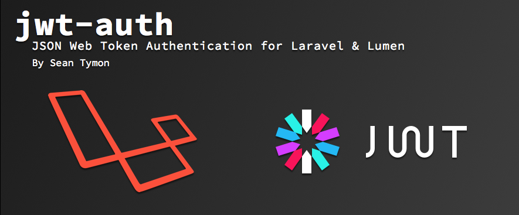

# lumen55-rest-api-demo
## Lumen with JWT Authentication, Dingo API and CORS Support



[](https://travis-ci.org/tymondesigns/jwt-auth)
[](https://codecov.io/github/tymondesigns/jwt-auth)
[](https://styleci.io/repos/23680678)
[](https://packagist.org/packages/tymon/jwt-auth)
[](https://packagist.org/packages/tymon/jwt-auth#dev-develop)
[](https://packagist.org/packages/tymon/jwt-auth)
[](https://www.versioneye.com/php/tymon:jwt-auth/dev-develop)
[](https://php-eye.com/package/tymon/jwt-auth)

This is a demo for lumen 5.5 REST api. 

For frontend example, im using [Vuejs 2.2](https://github.com/chrissetyawan/vuejs2-hybrid/) hybrid

## FEATURE

```

- Login, Logout, Register, Change password, Update Profile
- CRUD example, User Management, Role based restriction
- JWT-Auth - tymon/jwt-auth
- Dingo API - dingo/api
- vluzrmos/lumen-cors

```

## Quick Start

- Clone this repo or download it's release archive and extract it somewhere
- You may delete `.git` folder if you get this code via `git clone`
- Run `composer install`
- composer dump-autoload
- Run `php artisan jwt:generate`
- Configure your `.env` file for authenticating via database
- Set the `API_PREFIX` parameter in your .env file (usually `api`).
- Run `php artisan migrate --seed`
## USAGE

```
$ composer install
$ cp .env.example .env
$ vim .env
      DB_*          configuration your database
      JWT_SECRET    php artisan jwt:secret
      APP_KEY       key:generate is abandoned in lumen, 
                    please use md5(uniqid())，str_random(32) etc.，maybe use jwt:secret and copy it

$ php artisan migrate
$ php artisan db:seed
$ php -S localhost:8000 -t ./public


```
## REST API DESIGN

just a demo for rest api design

```
    demo： user, post
    
    post   /api/auth              	 create token
    post   /api/register              	 register a new user
    post   /api/login              	 login
    put    /api/authorizations/current   refresh token
    delete /api/logout            	 logout
    
    post   /api/posts              	 create a post
    get    /api/posts/5            	 post detail
    put    /api/posts/5            	 replace a post
    patch  /api/posts/5            	 update part of a post
    delete /api/posts/5            	 delete a post
    get    /api/users/4/posts            post list of a user
    get    /api/user/posts               post list of current user
```


- http://jwt-auth.com
- dingo/api [https://github.com/dingo/api](https://github.com/dingo/api)
- jwt(json-web-token) [https://github.com/tymondesigns/jwt-auth](https://github.com/tymondesigns/jwt-auth)
- transformer [fractal](http://fractal.thephpleague.com/)

> Renato Lucena - 2020
